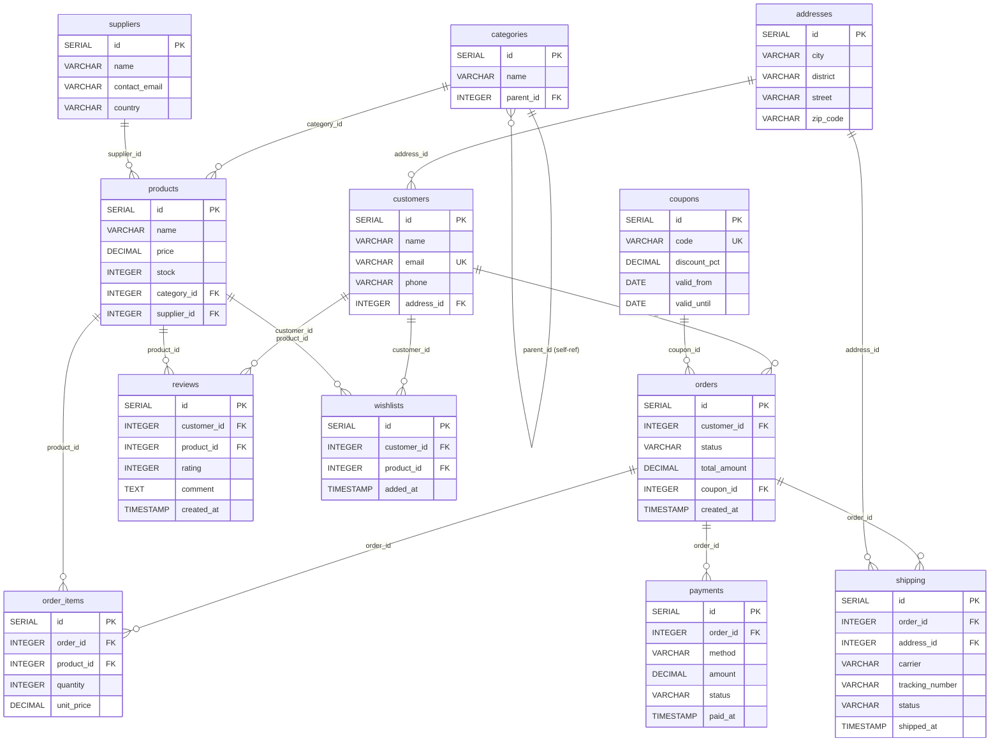
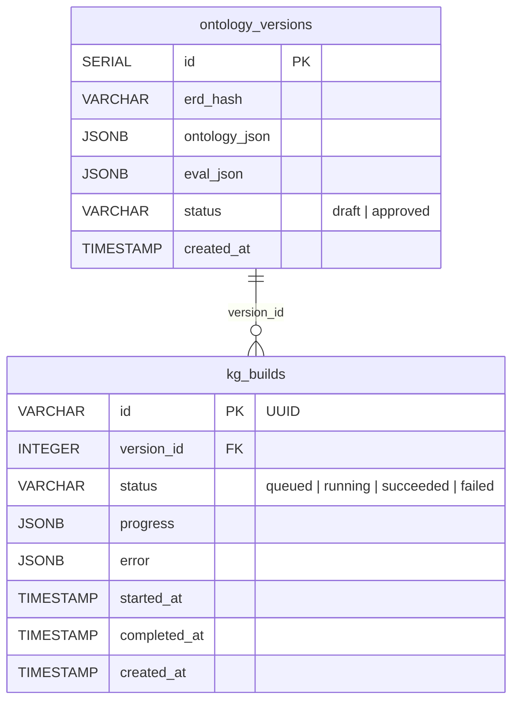
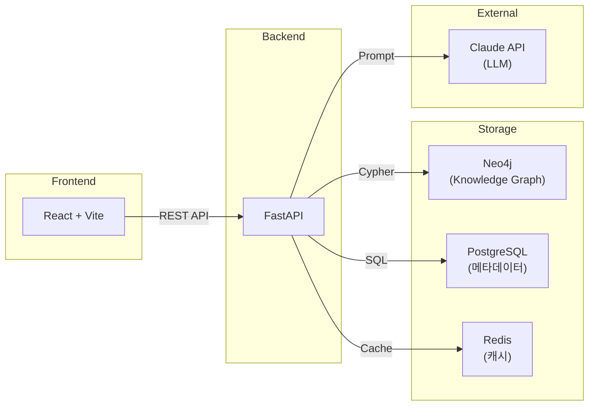

# GraphRAG ERD (Entity-Relationship Diagram)

## 1. E-Commerce 도메인 ERD (입력 데이터)

> 사용자가 업로드하는 DDL 스키마 — 12개 테이블, 15개 FK



---

## 2. 백엔드 메타데이터 DB ERD (PostgreSQL)

> GraphRAG 시스템이 내부적으로 사용하는 메타데이터 테이블



---

## 3. 시스템 아키텍처 (참고)



---

## dbdiagram.io 용 (복사해서 붙여넣기)

아래 코드를 [dbdiagram.io](https://dbdiagram.io)에 붙여넣으면 시각적 ERD가 자동 생성됩니다.

```dbml
// E-Commerce Domain Schema

Table addresses {
  id serial [pk]
  city varchar(100) [not null]
  district varchar(100) [not null]
  street varchar(200) [not null]
  zip_code varchar(10)
}

Table categories {
  id serial [pk]
  name varchar(100) [not null]
  parent_id integer [ref: > categories.id]
}

Table suppliers {
  id serial [pk]
  name varchar(100) [not null]
  contact_email varchar(200)
  country varchar(50) [default: 'KR']
}

Table coupons {
  id serial [pk]
  code varchar(50) [not null, unique]
  discount_pct decimal(5,2) [not null]
  valid_from date
  valid_until date
}

Table customers {
  id serial [pk]
  name varchar(100) [not null]
  email varchar(200) [not null, unique]
  phone varchar(20)
  address_id integer [not null, ref: > addresses.id]
}

Table products {
  id serial [pk]
  name varchar(200) [not null]
  price decimal(12,2) [not null]
  stock integer [default: 0]
  category_id integer [not null, ref: > categories.id]
  supplier_id integer [not null, ref: > suppliers.id]
}

Table orders {
  id serial [pk]
  customer_id integer [not null, ref: > customers.id]
  status varchar(20) [not null, default: 'pending']
  total_amount decimal(12,2)
  coupon_id integer [ref: > coupons.id]
  created_at timestamp [default: `CURRENT_TIMESTAMP`]
}

Table order_items {
  id serial [pk]
  order_id integer [not null, ref: > orders.id]
  product_id integer [not null, ref: > products.id]
  quantity integer [not null, default: 1]
  unit_price decimal(12,2) [not null]
}

Table payments {
  id serial [pk]
  order_id integer [not null, ref: > orders.id]
  method varchar(50) [not null]
  amount decimal(12,2) [not null]
  status varchar(20) [not null, default: 'pending']
  paid_at timestamp
}

Table reviews {
  id serial [pk]
  customer_id integer [not null, ref: > customers.id]
  product_id integer [not null, ref: > products.id]
  rating integer [not null, note: 'CHECK 1~5']
  comment text
  created_at timestamp [default: `CURRENT_TIMESTAMP`]
}

Table wishlists {
  id serial [pk]
  customer_id integer [not null, ref: > customers.id]
  product_id integer [not null, ref: > products.id]
  added_at timestamp [default: `CURRENT_TIMESTAMP`]
}

Table shipping {
  id serial [pk]
  order_id integer [not null, ref: > orders.id]
  address_id integer [not null, ref: > addresses.id]
  carrier varchar(100)
  tracking_number varchar(100)
  status varchar(20) [not null, default: 'preparing']
  shipped_at timestamp
}

// --- Backend Metadata Tables ---

Table ontology_versions {
  id serial [pk]
  erd_hash varchar(64) [not null]
  ontology_json jsonb [not null]
  eval_json jsonb
  status varchar(20) [not null, default: 'draft', note: 'draft | approved']
  created_at timestamp [default: `NOW()`]
}

Table kg_builds {
  id varchar(64) [pk, note: 'UUID']
  version_id integer [not null, ref: > ontology_versions.id]
  status varchar(20) [not null, default: 'queued', note: 'queued|running|succeeded|failed']
  progress jsonb
  error jsonb
  started_at timestamp
  completed_at timestamp
  created_at timestamp [default: `NOW()`]
}
```
