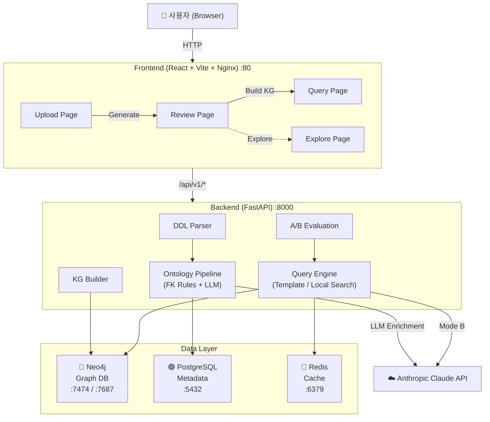

<!-- Badges -->
<p align="center">
  
  
  
  
  
  
  
</p>

<h1 align="center">GraphRAG Ontology Builder</h1>

<p align="center">
  SQL DDL 파일 하나를 업로드하면 Knowledge Graph가 자동 생성되고,<br/>
  자연어로 관계 추론 질문에 근거 경로와 함께 답변하는 B2B SaaS PoC
</p>

<p align="center">
  <a href="http://35.216.107.229/">🌐 Live Demo</a> · <a href="https://github.com/moinji/GraphRAG">📦 GitHub</a> · <a href="docs/PLAN.md">📋 개발 계획서</a>
</p>

---

## 📌 프로젝트 소개

GraphRAG Ontology Builder는 데이터베이스 스키마(DDL)로부터 **온톨로지를 자동 생성**하고, 이를 기반으로 **Neo4j Knowledge Graph를 구축**한 뒤, **자연어 질의(Q&A)** 를 지원하는 엔드투엔드 파이프라인입니다.

### 주요 기능

| 기능 | 설명 |
|------|------|
| **DDL 업로드 & ERD 파싱** | SQL DDL 파일을 업로드하면 테이블, 컬럼, FK를 자동 추출 |
| **온톨로지 자동 생성** | FK 규칙 엔진(Stage 1) + Claude LLM 보강(Stage 2) |
| **온톨로지 리뷰/편집** | 노드·관계 CRUD, 방향 반전, LLM Diff 확인 |
| **버전 관리** | Draft → Approved 워크플로, 평가 지표 자동 계산 |
| **KG 자동 빌드** | 승인된 온톨로지로 Neo4j에 Knowledge Graph 빌드 |
| **하이브리드 Q&A** | Mode A (템플릿 기반, 빠름) / Mode B (LLM 로컬서치, 정확) |
| **그래프 시각화** | Cytoscape.js 기반 인터랙티브 탐색, 필터링, 이웃 확장 |
| **CSV 임포트** | CSV 파일 업로드 후 스키마 검증 및 KG 빌드에 활용 |
| **A/B 평가** | 50개 골든 Q&A 기반 정확도·비용 비교 |

---

## 🏗️ 시스템 아키텍처



---

## 🛠️ 기술 스택

| Layer | Technology |
|-------|-----------|
| **Frontend** | React 19, TypeScript 5.9, Vite 7, Tailwind CSS 4, shadcn/ui, Cytoscape.js |
| **Backend** | Python 3.11, FastAPI, SQLGlot, neo4j-driver, Anthropic SDK |
| **Graph DB** | Neo4j 5 Community |
| **Metadata DB** | PostgreSQL 16 |
| **Cache** | Redis 7 |
| **Infra** | Docker Compose, Nginx, GCP Compute Engine (e2-medium) |

---

## 🚀 빠른 시작

### 사전 요구사항

- [Docker](https://docs.docker.com/get-docker/) & Docker Compose
- [Anthropic API Key](https://console.anthropic.com/) (LLM 기능 사용 시)

### 설치 및 실행

```bash
# 1. 저장소 클론
git clone https://github.com/moinji/GraphRAG.git
cd GraphRAG

# 2. 환경 변수 설정
cp .env.example .env
# .env 파일을 열어 ANTHROPIC_API_KEY 입력

# 3. 전체 서비스 빌드 및 실행
docker compose up --build -d

# 4. 브라우저에서 접속
# http://localhost
```

### 개발 모드 (핫 리로드)

```bash
# 인프라만 Docker로 실행
docker compose up -d neo4j postgres redis

# 백엔드
cd backend
pip install -r ../requirements.txt
uvicorn app.main:app --reload --port 8000

# 프론트엔드
cd frontend
npm install
npm run dev
```

---

## 📖 사이트 이용 가이드

### Step 1: DDL 업로드

[TODO: 스크린샷]

1. `.sql` 파일을 업로드합니다
2. 파싱된 ERD 결과(테이블, 컬럼, PK/FK)를 확인합니다
3. LLM 보강 여부를 선택하고 **Generate Ontology** 를 클릭합니다

### Step 2: 온톨로지 리뷰

[TODO: 스크린샷]

1. **Auto / Review** 모드를 전환합니다
2. Review 모드에서 노드·관계를 편집합니다 (추가, 수정, 삭제, 방향 반전)
3. Changes 탭에서 LLM이 변경한 Diff를 확인합니다
4. **Save** → **Approve** → (선택) CSV 업로드 → **Build KG**

### Step 3: Q&A 질의

[TODO: 스크린샷]

1. 데모 질문을 클릭하거나 직접 질문을 입력합니다
2. **Mode A** (템플릿 기반, 빠름) / **Mode B** (LLM 로컬서치, 정확) 전환
3. 답변과 함께 Cypher 쿼리, Evidence Path를 확인합니다

### Step 4: 그래프 탐색 (Explore)

[TODO: 스크린샷]

1. 전체 Knowledge Graph를 시각화합니다
2. 노드 검색, 라벨/엣지 타입별 필터링을 합니다
3. 노드 클릭 → 상세 정보 확인 + 이웃 노드 확장
4. 레이아웃 전환: **cose** (물리 시뮬레이션) / **dagre** (계층형) / **circular** (원형)

---

## 🗄️ Neo4j 사용법

### 접속 정보

| 항목 | 값 |
|------|-----|
| Browser UI | http://localhost:7474 |
| Bolt URI | `bolt://localhost:7687` |
| Username | `neo4j` |
| Password | `password123` |

> 배포 서버: http://35.216.107.229:7474 (방화벽 허용 시)

### 기본 Cypher 쿼리

```cypher
-- 전체 노드 보기
MATCH (n) RETURN n LIMIT 50

-- 노드 라벨별 카운트
MATCH (n) RETURN labels(n) AS label, count(*) AS count

-- 관계 타입별 카운트
MATCH ()-[r]->() RETURN type(r) AS type, count(*) AS count

-- 특정 노드와 연결된 관계 탐색
MATCH (n {name: '김민수'})-[r]-(m) RETURN n, r, m

-- 전체 데이터 초기화 (주의!)
MATCH (n) DETACH DELETE n
```

### CLI에서 쿼리 실행

```bash
docker exec graphrag-neo4j cypher-shell \
  -u neo4j -p password123 \
  "MATCH (n) RETURN labels(n), count(*)"
```

---

## 📡 API 엔드포인트

| Method | Endpoint | 설명 |
|--------|----------|------|
| `GET` | `/api/v1/health` | 시스템 헬스체크 (Neo4j, PG, Redis) |
| `POST` | `/api/v1/ddl/upload` | DDL 파일 업로드 및 ERD 파싱 |
| `POST` | `/api/v1/ontology/generate` | 온톨로지 자동 생성 |
| `PUT` | `/api/v1/ontology/versions/{id}` | 온톨로지 수정 (Draft 상태) |
| `POST` | `/api/v1/ontology/versions/{id}/approve` | 온톨로지 승인 |
| `POST` | `/api/v1/kg/build` | KG 빌드 작업 시작 (비동기) |
| `GET` | `/api/v1/kg/build/{job_id}` | KG 빌드 상태 조회 |
| `POST` | `/api/v1/query` | 자연어 질의 (mode: `a` / `b`) |
| `POST` | `/api/v1/csv/upload` | CSV 데이터 업로드 |
| `GET` | `/api/v1/graph/stats` | 그래프 통계 (노드/엣지 카운트) |
| `GET` | `/api/v1/graph/full?limit=500` | 전체 그래프 데이터 조회 |
| `GET` | `/api/v1/graph/neighbors/{node_id}` | 특정 노드의 이웃 조회 |

---

## 📂 프로젝트 구조

```
GraphRAG/
├── backend/
│   ├── app/
│   │   ├── main.py                  # FastAPI 앱 엔트리포인트
│   │   ├── config.py                # 환경 변수 설정
│   │   ├── models/schemas.py        # Pydantic 데이터 모델
│   │   ├── ddl_parser/              # DDL 파싱 (sqlglot)
│   │   ├── ontology/                # 온톨로지 파이프라인
│   │   │   ├── pipeline.py          # Stage 1 + 2 오케스트레이션
│   │   │   ├── fk_rule_engine.py    # FK 기반 규칙 엔진
│   │   │   └── llm_enricher.py      # Claude LLM 보강
│   │   ├── kg_builder/              # Knowledge Graph 빌드
│   │   │   ├── service.py           # 비동기 작업 관리
│   │   │   └── loader.py            # Neo4j 데이터 로딩
│   │   ├── query/                   # 질의 엔진
│   │   │   ├── pipeline.py          # 쿼리 파이프라인
│   │   │   ├── router.py            # 라우팅 (규칙 / LLM)
│   │   │   ├── executor.py          # Cypher 실행
│   │   │   ├── local_search.py      # Mode B 로컬 서치
│   │   │   └── template_registry.py # 쿼리 템플릿
│   │   ├── evaluation/              # A/B 평가
│   │   ├── csv_import/              # CSV 임포트
│   │   └── routers/                 # API 라우터
│   ├── tests/                       # pytest 테스트
│   └── Dockerfile
├── frontend/
│   ├── src/
│   │   ├── pages/                   # Upload, Review, Query, Explore
│   │   ├── components/
│   │   │   ├── ui/                  # shadcn/ui 컴포넌트
│   │   │   ├── graph/               # Cytoscape 그래프 컴포넌트
│   │   │   └── review/              # 리뷰 페이지 컴포넌트
│   │   ├── api/client.ts            # API 클라이언트
│   │   └── App.tsx                  # 앱 라우팅
│   ├── Dockerfile
│   └── nginx.conf
├── examples/
│   ├── schemas/                     # 데모 DDL (ecommerce, accounting)
│   └── data/                        # 샘플 CSV 데이터
├── docs/
│   ├── PLAN.md                      # 개발 계획서
│   ├── deploy.md                    # GCP 배포 가이드
│   ├── reports/                     # 주차별 보고서
│   └── demo/                        # 데모 스크립트
├── docker-compose.yml
├── .env.example
└── requirements.txt
```

---

## ⚙️ 환경 변수

`.env.example`을 `.env`로 복사한 뒤 아래 값을 설정합니다.

| 변수 | 기본값 | 설명 |
|------|--------|------|
| `NEO4J_URI` | `bolt://localhost:7687` | Neo4j Bolt 연결 주소 |
| `NEO4J_USER` | `neo4j` | Neo4j 사용자명 |
| `NEO4J_PASSWORD` | `password123` | Neo4j 비밀번호 |
| `POSTGRES_HOST` | `localhost` | PostgreSQL 호스트 |
| `POSTGRES_PORT` | `5432` | PostgreSQL 포트 |
| `POSTGRES_USER` | `graphrag` | PostgreSQL 사용자명 |
| `POSTGRES_PASSWORD` | `graphrag123` | PostgreSQL 비밀번호 |
| `POSTGRES_DB` | `graphrag_meta` | PostgreSQL 데이터베이스명 |
| `REDIS_URL` | `redis://localhost:6379/0` | Redis 연결 URL |
| `ANTHROPIC_API_KEY` | _(빈 값)_ | Anthropic API 키 **(LLM 기능 필수)** |
| `ANTHROPIC_MODEL` | `claude-sonnet-4-20250514` | 사용할 Claude 모델 |
| `APP_ENV` | `development` | 실행 환경 (`development` / `production`) |
| `DDL_MAX_SIZE_MB` | `10` | DDL 파일 최대 크기 (MB) |

> **참고:** Docker Compose 환경에서는 호스트명을 컨테이너명으로 변경합니다 (`localhost` → `neo4j`, `postgres`, `redis`).

---

## 🌐 배포

### 로컬 배포

```bash
docker compose up --build -d
# http://localhost 접속
```

### GCP 배포

자세한 가이드는 [docs/deploy.md](docs/deploy.md)를 참고하세요.

```bash
# VM에서 실행
git clone https://github.com/moinji/GraphRAG.git
cd GraphRAG
cp .env.example .env && nano .env   # API 키 설정
docker compose up --build -d
```

| 환경 | URL |
|------|-----|
| 프론트엔드 | http://35.216.107.229 |
| API 헬스체크 | http://35.216.107.229/api/v1/health |
| Neo4j Browser | http://35.216.107.229:7474 |

---

## 🧪 테스트

```bash
cd backend
pytest -v
```

주요 테스트 범위:
- DDL 파싱 (`test_ddl_parser.py`)
- 온톨로지 생성 (`test_ontology.py`)
- KG 빌드 (`test_kg_build.py`)
- 쿼리 실행 (`test_query.py`, `test_local_search.py`)
- CSV 임포트 (`test_csv_import.py`)
- A/B 평가 (`test_qa_evaluation.py`)
- E2E 통합 (`test_e2e_integration.py`)

---

## 📚 문서

- [개발 계획서](docs/PLAN.md)
- [배포 가이드](docs/deploy.md)
- [PoC 목표/KPI](docs/POC_DOD_KPI.md)
- [주차별 보고서](docs/reports/)
- [데모 스크립트](docs/demo/)
